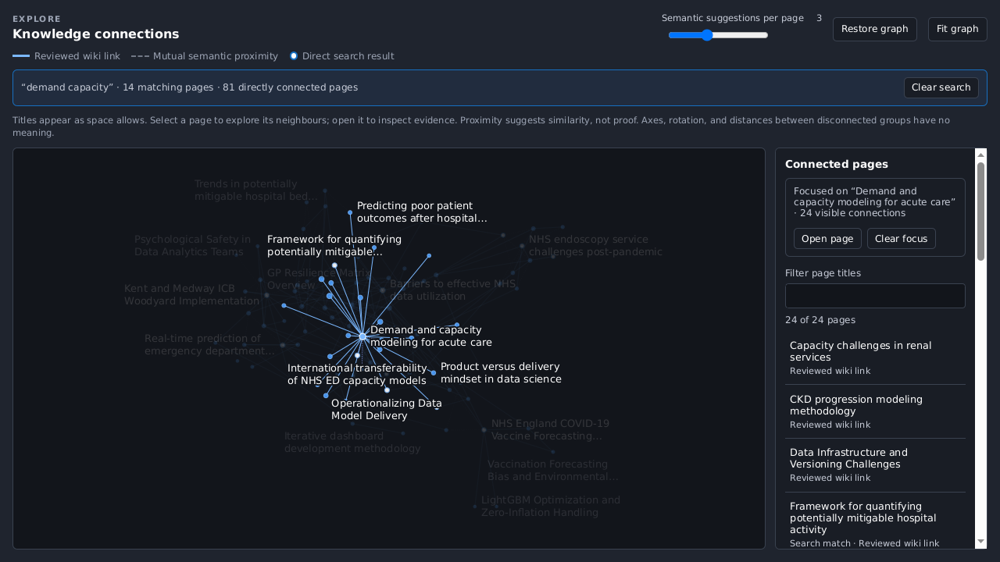

# Synthesis ⚗️

Synthesis turns PDFs, Markdown, text, and YouTube recordings into a persistent,
linked Markdown wiki. It archives every source, drafts cited wiki changes, and
waits for review before changing the wiki.

The vault stays on your device. Markdown, source archives, and history are
authoritative; SQLite search and embeddings are rebuildable. Reading, evidence,
keyword search, export, rebuild, and undo work without an AI provider.

Synthesis is a single-user research MVP. It is not a clinical decision-support
tool and is not intended for production or regulated workloads.


## Five-minute start

Download and extract the archive for your platform from the
[v0.2.3 release](https://github.com/The-Strategy-Unit/synthesis/releases/tag/v0.2.3).
The executables are unsigned; macOS builds are not notarised.

Try the disposable, provider-free example:

```bash
# Linux or macOS
chmod +x synthesis-*
./synthesis-linux-x86_64 --trial       # Linux
./synthesis-macos-aarch64 --trial      # macOS ARM64

# Windows PowerShell
.\synthesis-windows-x86_64.exe --trial
```

Or explore the included HACA 2025 vault:

```bash
./synthesis-linux-x86_64 --vault haca-2025-vault
./synthesis-macos-aarch64 --vault haca-2025-vault
.\synthesis-windows-x86_64.exe --vault haca-2025-vault
```

The HACA vault contains 344 AI-drafted pages compiled from 66 conference
recordings. Its [README](demos/haca-2025-vault/README.md) records provenance,
review, and limitations.

## Run from source

Requirements: Deno 2+, Ollama for the default local provider, and `yt-dlp` only
for YouTube ingestion.

```bash
git clone https://github.com/The-Strategy-Unit/synthesis.git
cd synthesis
deno task setup
deno task app
```

The app opens `http://localhost:8000` and uses `~/Synthesis` by default.
Override the vault with `SYNTHESIS_VAULT=/path/to/vault`. Use only one running
Synthesis process per writable vault.

The default Ollama models are `qwen3.8:27b` for writing and
`nomic-embed-text-v2-moe:latest` for embeddings. The **Provider** screen can
select another local or OpenAI-compatible provider. Remote providers receive the
source and wiki text needed for each request under their own terms; Synthesis
never silently switches from local to remote.

## Everyday workflow

1. **Add source**: upload a born-digital PDF, Markdown, or text file; paste
   text; or provide a YouTube URL.
2. **Review**: inspect proposed `new`, `merge`, or `contradict` changes and
   their evidence. Edit, select, approve, or reject them.
3. **Read**: navigate wiki pages, source evidence, keyword or semantic search,
   and the graph.
4. **Synthesis review**: inspect proposed cross-source relationships. They
   remain suggestions until confirmed.
5. **Ask wiki**: generate an answer from compiled pages and save it only after
   review.
6. **Maintain**: run wiki health checks and export the vault regularly.


Scanned or encrypted PDFs are rejected; run OCR first. YouTube ingestion needs
`yt-dlp` beside the executable or on `PATH`.

Trusted-video batches can automatically select every staged change only after an
exact, count-specific confirmation. This saves review clicks; it does not make
model output reliable. Cross-source proposals always require human review.

## Evidence and connections

- Source markers on claims link back to immutable archived evidence.
- Blue graph edges are reviewed wiki links stored in Markdown.
- Grey edges are mutual embedding-neighbour suggestions, not facts or confidence
  scores.
- Model output is bounded and validated but can still be wrong. Follow the cited
  source before consequential use.



## Vault, backup, and recovery

```text
vault.json       vault identity and format
schema.md        compilation policy
notes/           ordinary Markdown wiki
sources/         immutable originals and extracted evidence
history/         accepted changes and undo records
synthesis.db     rebuildable search, vector, and graph state
```

Use **Vault tools → Export vault** for a portable tar archive. Exports exclude
SQLite and provider credentials. To restore, extract into an empty directory,
open it as the vault, and choose **Rebuild catalogue**. Rebuild is
provider-free; semantic search requires a separate **Build semantic index**
operation.

**Undo ingest** restores only the newest accepted ingest and refuses to
overwrite pages changed since approval. Immutable sources and history remain
available.

Stop Synthesis before moving or backing up a live vault. Keep the entire vault
directory together.

## Development and documentation

```bash
deno task check
deno task test:unit
deno task test:integration
deno task test:e2e
deno task test:browser
deno task compile
```

- [Architecture](docs/ARCHITECTURE.md): data flow, storage, trust boundaries,
  and packaging.
- [Developer guide](docs/DEVELOPERS.md): setup, configuration, API, tests, and
  release procedure.

## Limits

- One stateful process and one writable vault; no multi-user collaboration.
- No supported serverless, distributed, or production deployment.
- AI-generated text requires human judgement and source verification.
- PDF extraction handles text, not OCR or document-layout understanding.
- Provider quality, privacy, cost, and availability vary.
- The archived project has no maintenance, security-response, or support
  commitment.

## Licence

[MIT](LICENSE). It provides the software without
