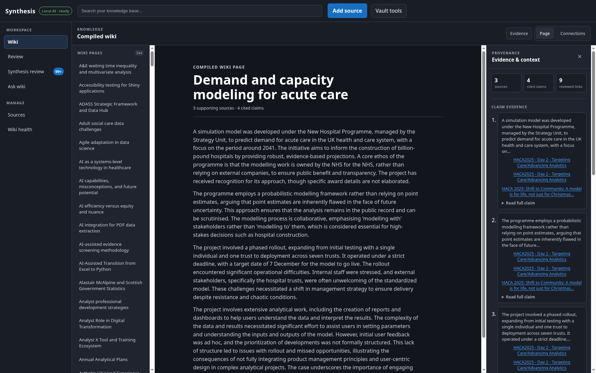
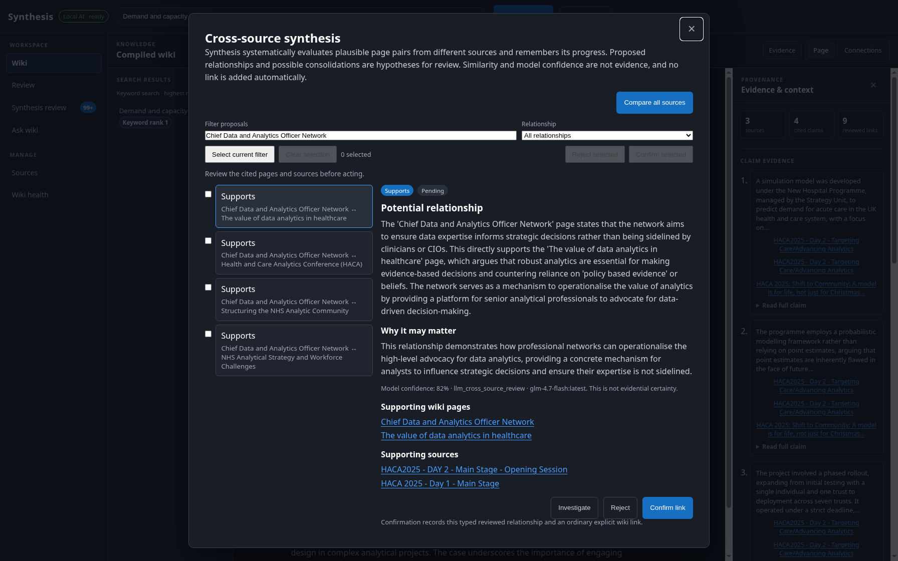
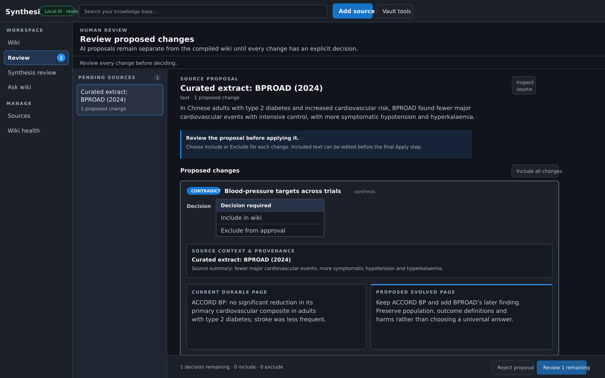

<!-- _class: hero title-slide -->

# Synthesis ⚗️

## Your sources. A wiki that lasts.

Selected evidence → durable knowledge

Eirini Komninou, PhD - Data Science @ The Strategy Unit

<!--
Timing: 0:30 (cumulative 0:30)

Preparation: Synthesis is the application; the wiki is its output. Use “wiki”,
“wiki page”, “source” and “proposed update”. Present it as a working local-first,
single-user MVP whose wiki, sources and history remain ordinary files.

Evidence: README.md introduction and "Vault and recovery".
-->

---

<!-- _class: brief -->

## Sources persist. Does the understanding?

<div class="grid three">
  <div class="card"><h3>Connections</h3><p>Across sources</p></div>
  <div class="card"><h3>Context</h3><p>Across time</p></div>
  <div class="card"><h3>Evidence</h3><p>Back to origin</p></div>
</div>

<p class="takeaway">Knowledge should compound.</p>

<nav class="slide-nav" aria-label="Appendix navigation">
  <a class="nav-topics" href="#14">Appendix topics</a>
</nav>

<!--
Timing: 0:45 (cumulative 1:15)

Preparation: start with the audience's source collection. The files endure, but
their connections and context are often rebuilt from memory. The question sets
up the LLM Wiki as a way for understanding to accumulate with its evidence.
-->

---

<!-- _class: brief -->

## The LLM Wiki idea

<p class="credit">Inspired by <a href="https://gist.github.com/karpathy/442a6bf555914893e9891c11519de94f">Andrej Karpathy’s LLM Wiki pattern</a></p>

<div class="grid three">
  <div class="card"><h3>Pages</h3><p>Give topics a home</p></div>
  <div class="card"><h3>Links</h3><p>Keep context connected</p></div>
  <div class="card"><h3>Updates</h3><p>Build on earlier sources</p></div>
</div>

<p class="takeaway">A synthesised wiki. Durable knowledge.</p>

<!--
Timing: 1:00 (cumulative 2:15)

Preparation: credit Andrej Karpathy. The pattern uses an LLM to maintain a
persistent linked wiki as sources arrive; Synthesis adds a bounded workflow and
review by default. Wiki pages are durable knowledge, while sources remain
separate evidence. The Wikipedia analogy is the lasting page-link-revision
shape, not its infrastructure, governance or authority.

Reference: https://gist.github.com/karpathy/442a6bf555914893e9891c11519de94f
Evidence: README.md introduction; docs/ARCHITECTURE.md "Ingest pipeline".
-->

---

<!-- _class: brief -->

## HACA 2025, in one wiki

<div class="grid three">
  <div class="card"><span class="metric-number">66</span><span class="metric-label">recordings</span></div>
  <div class="card"><span class="metric-number">344</span><span class="metric-label">draft wiki pages</span></div>
  <div class="card boundary"><span class="metric-number">29</span><span class="metric-label">later-source updates</span></div>
</div>

<p class="footnote">Automatic compilation - publication consistency pass</p>

<nav class="slide-nav" aria-label="Appendix navigation">
  <a class="nav-topics" href="#14">Appendix topics</a>
</nav>

<!--
Timing: 0:45 (cumulative 3:00)

Preparation: HACA is the Health and Care Analytics Conference. The demo records
66 sources and 373 changes: 344 new pages, 28 merges and one contradiction.
Twenty-nine updates are not necessarily 29 distinct pages. Compilation was an
automatic batch followed by a consistency pass-not independent verification.
Treat the pages and metrics as a working demonstration, not an outcome claim.

Evidence: origin/docs/haca-2025-synthesis-overview at dfd844a,
demos/haca-2025-vault/history/, notes/ and README.md.
-->

---

<!-- _class: brief -->

## Three talks. One wiki page.

<div class="grid three">
  <div class="card"><h3>Product</h3><p>Users and ownership</p></div>
  <div class="card"><h3>Model</h3><p>Probabilistic demand</p></div>
  <div class="card"><h3>Delivery</h3><p>One trust → seven</p></div>
</div>

<p class="takeaway">Demand and capacity modelling for acute care</p>

<nav class="slide-nav" aria-label="Appendix navigation">
  <a class="nav-topics" href="#14">Appendix topics</a>
</nav>

<!--
Timing: 1:00 (cumulative 4:00)

Preparation: the sources contribute three perspectives-users and ownership,
the modelling method, and delivery and rollout. The first created the page; the
next two updated it. The resulting page retains all three source routes and
still requires domain review.

Evidence: demos/haca-2025-vault/notes/demand-and-capacity-modeling-for-acute-care.md
on the demo branch; source hashes beginning 241007, e591c9 and a8eab1.
-->

---

<!-- _class: appendix screenshot -->



<nav class="slide-nav" aria-label="Appendix navigation">
  <a class="nav-topics" href="#14">Appendix topics</a>
</nav>

<!--
Timing: 2:15 (cumulative 6:15)

Preparation: introduce Synthesis spatially: workspace and page directory on the
left, compiled wiki in the centre, evidence and source routes on the right.
Demonstrate one route from a claim to its source. Association is not proof that
every source supports every statement; the person judges the interpretation.
Reading, source inspection and keyword search work without an AI provider.

Evidence: assets/synthesis_haca_page_slide.png;
src/http/routes/wiki_routes.ts; src/wiki/wiki.ts; web/app.js.
-->

---

<!-- _class: graph-shot -->


<nav class="slide-nav" aria-label="Appendix navigation">
  <a href="#15">Graph key →</a>
  <a class="nav-topics" href="#14">Appendix topics</a>
</nav>

<!--
Timing: 1:15 (cumulative 7:30)

Preparation: move from the Connections tab to the focused graph. One page opens
24 visible neighbours across methods, constraints and related work. Solid lines
are durable wiki links; dashed lines are semantic suggestions. HACA used a
confirmed automatic compilation, so reviewed does not mean individually
reviewed. Layout supports navigation, not proof.

Evidence: assets/synthesis_haca_graph_slide.png; src/wiki/wiki_graph.ts.
-->

---

<!-- _class: detail -->

## Cross-source synthesis

<p class="definition"><strong>Similarity</strong> finds possible neighbours → <strong>LLM comparison</strong> proposes how they may relate → <strong>Human review</strong> decides what becomes a wiki link</p>

<div class="crop discovery-evidence">
  
</div>

<nav class="slide-nav" aria-label="Appendix navigation">
  <a href="#16">Full wiki link review →</a>
  <a class="nav-topics" href="#14">Appendix topics</a>
</nav>

<!--
Timing: 1:30 (cumulative 9:00)

Preparation: semantic proximity uses embedding cosine similarity; lexical
overlap can also nominate candidate pairs. Neither is evidence. The LLM compares
pages from different sources and may propose support, contradiction, dependency,
research gap, overlap or another typed hypothesis—or nothing. A person checks
the pages and sources; only confirmation creates a durable wiki link. The 82%
value is model output, not evidence or a calibrated probability.

Evidence: assets/cross-source_synthesis.png; src/wiki/discovery.ts;
src/http/routes/review_routes.ts; web/app.js.
-->

---

<!-- _class: detail -->

## Lower blood pressure. Better outcomes?

<p class="definition">Type 2 diabetes · systolic target &lt;120 vs &lt;140 mm Hg</p>

<div class="update-story">
  <div class="card"><h3>Existing wiki</h3><p>ACCORD BP:<br />No significant reduction in major cardiovascular events.</p></div>
  <div class="update-arrow" aria-hidden="true">→</div>
  <div class="card"><h3>New source</h3><p>BPROAD:<br />Fewer major cardiovascular events.</p></div>
  <div class="update-arrow" aria-hidden="true">→</div>
  <div class="card boundary"><h3>Proposed wiki update</h3><p>Keep both findings.<br />Preserve their trial context.</p></div>
</div>

<p class="takeaway">New evidence can qualify—not overwrite—the wiki.</p>

<p class="footnote">Supported inputs: pasted text · Markdown or text files · text PDFs · YouTube videos or playlists</p>

<nav class="slide-nav" aria-label="Appendix navigation">
  <a class="nav-topics" href="#14">Appendix topics</a>
</nav>

<!--
Timing: 1:00 (cumulative 10:00)

Preparation: a selected source is archived before exact Markdown changes are
proposed. ACCORD BP did not find a significant reduction in its primary
composite; BPROAD did. The proposed update keeps both findings and their trial
context. A non-significant result is not proof of no benefit; do not imply the
trials establish opposite effects. This is a research illustration, not
clinical guidance. YouTube ingestion requires available subtitles; encrypted
and image-only PDFs require preprocessing because Synthesis has no OCR.

Evidence for behaviour: src/ingest/orchestrate.ts;
src/ingest/ingest_proposal.ts; src/vault/ingest_history.ts.
Trial evidence: PubMed 20228401 and 39555827.
-->

---

<!-- _class: appendix screenshot -->



<nav class="slide-nav" aria-label="Appendix navigation">
  <a class="nav-topics" href="#14">Appendix topics</a>
</nav>

<!--
Timing: 1:00 (cumulative 11:00)

Preparation: continue the ACCORD BP/BPROAD story from the previous slide. The
new BPROAD source proposes a contradiction update that keeps both trial findings
and their context. Decision required, Include in wiki and Exclude from approval
make review granular; no wiki page changes before approval.

The image is a controlled review-state illustration using current interface
labels and curated trial excerpts, not a clinical or model-performance claim.

Evidence: assets/synthesis_review_bproad.svg; web/index.html; web/app.js;
src/ingest/orchestrate.ts; src/ingest/ingest_proposal.ts.
-->

---

<!-- _class: brief -->

## The wiki is yours to keep

<div class="grid three">
  <div class="card"><h3>Read</h3><p>Ordinary Markdown</p></div>
  <div class="card"><h3>Trace</h3><p>Sources and history</p></div>
  <div class="card"><h3>Recover</h3><p>Export · rebuild · undo</p></div>
</div>

<p class="footnote">Linked, revisable pages have endured at scale: Wikipedia, 2001 → 65 million articles. <a href="https://wikimediafoundation.org/wikipedia25/">Wikimedia Foundation</a></p>

<nav class="slide-nav" aria-label="Appendix navigation">
  <a href="#17">Vault and recovery →</a>
  <a class="nav-topics" href="#14">Appendix topics</a>
</nav>

<!--
Timing: 1:30 (cumulative 12:30)

Preparation: Wikipedia shows that linked, revisable pages can persist and grow;
do not imply that Synthesis shares its infrastructure, governance, collaboration
or proven scale. Here, ownership comes from ordinary Markdown, retained sources
and portable history. SQLite and semantic state are rebuildable. Exports exclude
the derived database and provider credentials.

Evidence: README.md "Vault and recovery"; src/vault/vault_export.ts;
src/vault/vault_rebuild.ts; src/vault/ingest_undo.ts.
Reference: https://wikimediafoundation.org/wikipedia25/
-->

---

<!-- _class: brief -->

## Current scope

<div class="grid three">
  <div class="card"><h3>Single-user</h3><p>Local-first MVP</p></div>
  <div class="card"><h3>Human judgement</h3><p>Check claims and links</p></div>
  <div class="card"><h3>Provider choice</h3><p>Remote AI receives content</p></div>
</div>

<p class="footnote">Research and knowledge work. No clinical decision support.</p>

<nav class="slide-nav" aria-label="Appendix navigation">
  <a class="nav-topics" href="#14">Appendix topics</a>
</nav>

<!--
Timing: 0:45 (cumulative 13:15)

Preparation: this is a single-user MVP, not collaborative or multi-tenant.
Generated text can be wrong, and merged paragraphs can cite several sources.
Local AI is the default; remote AI is an explicit data-transfer choice with no
silent fallback. Synthesis is not clinical decision support or an autonomous
consequential decision tool.

Evidence: README.md; src/provider/provider_runtime.ts;
src/provider/provider_profile.ts; src/wiki/wiki.ts.
-->

---

<!-- _class: hero -->

# Questions

## Where would a maintained wiki improve real work?

[https://github.com/The-Strategy-Unit/synthesis](https://github.com/The-Strategy-Unit/synthesis)

<nav class="slide-nav" aria-label="Appendix navigation">
  <a href="#14">Explore appendix topics →</a>
</nav>

<!--
Timing: 0:45 (cumulative 14:00; 6:00 remains for discussion)

Preparation: invite questions about useful collections, trust and remaining
uncertainty. Use the appendix links for detail. The public project link does not
include the HACA demo vault.

For a live demo, prepare the demo-branch HACA vault before the session and keep
the screenshots as fallback. Do not modify the demo vault during the talk.
-->

---

<!-- _class: appendix -->

## Appendix topics

<div class="grid three appendix-menu">
  <div class="card">
    <h3>Graph</h3>
    <a href="#15">How to read the graph</a>
  </div>
  <div class="card">
    <h3>Review</h3>
    <a href="#16">Full wiki link review</a>
  </div>
  <div class="card">
    <h3>Portability</h3>
    <a href="#17">Vault and recovery</a>
  </div>
</div>

<nav class="slide-nav" aria-label="Presentation navigation">
  <a href="#13">← Questions</a>
</nav>

<!--
Discussion menu, outside the timed talk. Choose a topic; use its footer to
return to the corresponding main slide, this menu or Questions.

Navigation uses Marp's one-based slide anchors. When adding or reordering slides,
update all numeric href targets, including the paired return links.
-->

---

<!-- _class: appendix -->

## How to read the graph

| What you see         | What it means                                         |
| -------------------- | ----------------------------------------------------- |
| Focused page         | A named neighbourhood to explore                      |
| Solid blue line      | Durable wiki link                                     |
| Dashed grey line     | Semantic suggestion; not yet a wiki link              |
| Position or distance | Navigation layout; not importance, proof or certainty |

<p class="takeaway">Connections suggest routes to inspect. Evidence remains the test.</p>

<nav class="slide-nav" aria-label="Presentation navigation">
  <a href="#7">← Knowledge connections</a>
  <a class="nav-topics" href="#14">Appendix topics</a>
  <a href="#13">Questions</a>
</nav>

<!--
Preparation: use only if graph interpretation comes up. Search and focus turn
the graph into a named neighbourhood. Solid links are durable; dashed proximity
edges remain suggestions. Geometry has no analytical meaning. Browsing an
already-built graph works without a provider; creating semantic suggestions
requires embeddings.

Evidence: src/catalogue/search_store.ts; src/wiki/wiki_graph.ts;
web/graph_layout.js; web/app.js.
-->

---

<!-- _class: appendix screenshot -->


<nav class="slide-nav" aria-label="Presentation navigation">
  <a href="#8">← Cross-source synthesis</a>
  <a class="nav-topics" href="#14">Appendix topics</a>
  <a href="#13">Questions</a>
</nav>

<!--
The full wiki link review.

The filter shows four pending support hypotheses. The selected proposal remains
pending; no decision was made for this capture. The model label records the
provider used to generate the proposal. "Local AI - ready" reports the provider
currently available to the app.

Use cross-source synthesis for the comparison and proposal capability; use wiki
link review for the human decision that can make a relationship durable. The
model-confidence percentage is not a calibrated probability or evidence of
correctness.

Evidence: src/wiki/discovery.ts; src/http/routes/review_routes.ts; web/app.js.
-->

---

<!-- _class: appendix -->

## Portable wiki, rebuildable catalogue

```text
vault.json - schema.md
notes/       wiki pages
sources/     immutable evidence
history/     accepted updates and undo receipts

synthesis.db rebuildable catalogue
```

<p class="footnote">Export excludes the database and keys. Undo is newest-ingest-only.</p>

<nav class="slide-nav" aria-label="Presentation navigation">
  <a href="#11">← The wiki is yours to keep</a>
  <a class="nav-topics" href="#14">Appendix topics</a>
  <a href="#13">Questions</a>
</nav>

<!--
A vault is the storage folder containing the wiki, sources and history.
Retain the exact on-disk names here; "synthesis.db" is a filename, not a second
term for the wiki.

Catalogue rebuild is provider-free. Embeddings and semantic suggestions are
rebuilt separately with a provider. Undo remains hash guarded and can be blocked
by later edits. It does not clean up links from unrelated later pages.
Backups remain an operator responsibility.

Evidence: src/vault/vault_export.ts; src/vault/vault_rebuild.ts;
src/vault/ingest_undo.ts.
-->
